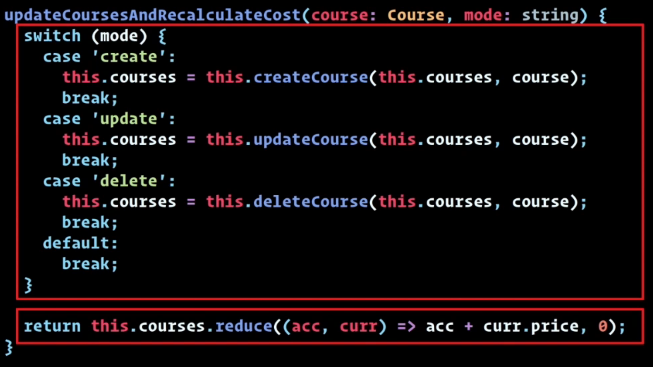
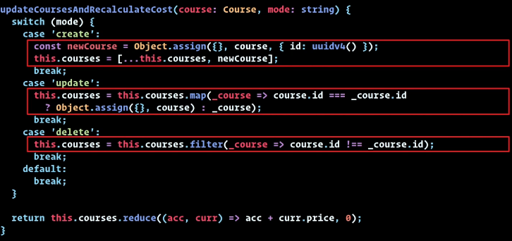
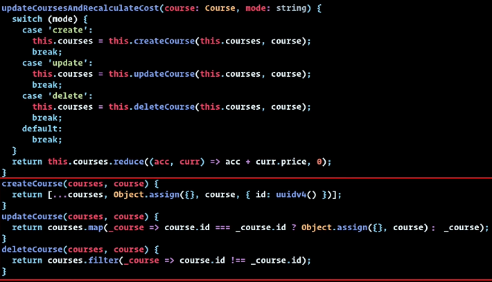

## Complejidad

Lo principal que debemos tener en cuenta es:

- volumen del codigo
- manejo del estado
- control del flujo

**Micro**: a nivel de función

**Meso**: interacción entre componentes

**Macro**: A nivel de la aplicacción o interacción entre aplicaciones

### MICRO

Administrar la salida de una función.

> ❓ ¿Que hace esto?
>   ¿Puedo saber el resultado de esto en todo momento?
>   Puedo probar este código?
>   Puedo reutilizar este código?

#### Línea del mal

Principales problemas que generan una mayor complejidad.


##### Hidden State(Estado oculto)

📛 Si la salida de una función depende de una propiedad fuera de la función.
```js
class A {
  NameF(){
    switch(this.mode){
      ....
    }
  }
}

```

✔️✔️ Inyección de dependencias: que todos las variables que use la función solo sean locales a la función.

```ts
class A {
  NameF(mode: string){
    switch(mode){
      ....
    }
  }
}

```

##### SPR(Principio de responsabilidad única)

📛



✔️✔️ Extender método


Al extender el método nos encontramos con los métodos de control de tráfico aéreo que ejecuta las demás funciones y donde se maneja el flujo


##### Nested logic(lógica anidada)

📛



podemos solucionarla extendiendo el método y realizando inyección de dependencia

✔️✔️


